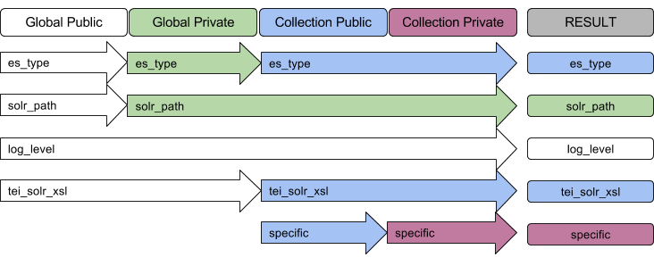

## Configuration

### Quick Start

Open up the `config/public.yml` file in your new collection and change the following.  You may remove the elasticsearch or solr keys if your collection will not need them.

```yaml
default:
  shortname: [collection]
  collection_desc: ["A phrase about your collection"]
  es_type: [usually shortname]
  solr_core: [usually shortname]
```

To see ALL of the options your collection will be using, you can run the following:

```
ruby scripts/ruby/print_options.rb collection_name
```

This will print out all of the arguments and configuration options after they have been smashed together.  If something looks amiss, you may need to override it in the collection config files.

Reasons why you might need to customize more stuff:

- you need a custom XSL script for HTML or Solr
- you have multiple environments with varying requirements
- you need to override defaults in `/config/public.yml` or `config/private.yml`
- your es_type needs to be different on your local machine than on the server

Read on if you would like to understand more about how the configuration files interact, if you need to add anything which should NOT be committed to version control, or if you just want to see some of the more common options.

If you are using Solr, you may need to specify an overriding XSL stylesheet.

Otherwise, continue to [preparing your index](prepare_index.md).

### Environments

Each config file is only required to have a "default" environment. Typically, the config file may also have "development" and "production", but you may add as many environments as you like with any names.

```
default:
  ...
development:
  ...
production:
  ...
jessica_test:
  ...
```

When you run a script, whether it be to clear an index or post files, you may pass it an environment.  If no environment is specified, it will attempt to use the `development` environment.  Anything NOT specified in a given environment will use the default environment's settings.

For example:

```
default:
  csv_html_ruby: scripts/ruby/csv_to_html.rb
  shortname: example
development:
  csv_html_ruby: collections/example/scripts/csv_testing.rb
```

In the above example, if you run `post.rb example` the script will use the development environment:

```
shortname: example
csv_html_ruby: collections/example/scripts/csv_testing.rb
```

If you instead run `post.rb example -e some_other_environment` then the script will use only the default settings, since it cannot locate that environment.

Each config file will shore up its environment before being compared to any other configurations which might override it.

### Inheritance

When it comes to clearing and posting to an index, there are four configuration files which you must be aware of.

- global public `config/public.yml`
- global private `config/private.yml`
- collection public `collections/[yours]/config/public.yml`
- collection private `collections/[yours]/config/private.yml` (optional)

**The most specific instance of a key will be used. That is, the keys inherit in the above order, waterfall style**

For example, if global public has key `solr_path: dev1.unl.edu` but your collection's private config has `solr_path: project.unl.edu`, the solr path used will be `project.unl.edu`



### Common Options

#### XSL Scripts

`tei_solr_xsl`: XSL which overrides the generic script to convert TEI XML to a solr format.  There are several variations on this theme:

tei_solr_xsl, vra_solr_xsl, dc_solr_xsl, csv_solr_xsl
tei_html_xsl, vra_html_xsl, dc_html_xsl, csv_html_xsl

Note that the above are not required for Elasticsearch, and are in fact only required for XSL specific transformations

```yaml
variables_html:
  fig_location:
  site_url:
variables_solr:
  collection:
  fig_location:
  file_location:
  site_url:
  slug:
```

These are used to pass information into the XSL scripts.  You may add any additional ones which you would like directly in your collection's configuration file.  Copy them into different environments if you need different URLs for development than production, etc.

#### private.yml

Things in `private.yml` always override things in `public.yml` and also are NOT committed to version control. This means two things:

- you can keep them out of the public eye
- easier to run the same environment from two places

Speaking to the first point, you may, for example, not want your solr_path endpoint available in github:

`solr_path: http://your_server:8080/solr`

Also, you may want to run something on localhost from your computer, but point it at a specific URL when running it from a shared server.  Rather than creating a whole new environment or having to manually change the URL each time, if the variable is defined in `private.yml` you shouldn't have to mess with it.

Some stuff commonly in `private.yml`:

- `threads: 5` (5 recommended for PC, 50 for powerful servers)
- `es_path: http://localhost:9200`
- `es_index: test1`
- `es_type: collection_name`
- `solr_path: http://localhost:8983/solr`
- `solr_core: collection_name`
